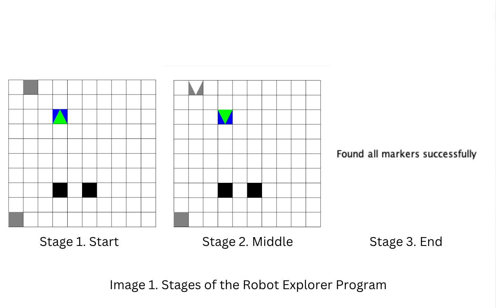

# Robot Explorer

## Description

This C program simulates a simple robot explorer (green triangle) navigating a grid environment. The grid consists of immovable blocks (black squares), markers (grey squares), and a home location (blue square). The robot's objective is to find markers, pick them up, and return them to the home location.

## Features

- The grid is randomly generated with immovable blocks, markers, and a home location (these are randomly generated each time).
- The robot starts at the home location and explores the grid to find markers.
- The robot uses a stack-based approach to remember its movements and track back to its home location.
- The process repeats for a specified number of markers.

## How to Compile and Run

To compile the program, ensure that you have the `graphics.c` file, `graphics.h` library and the `drawapp-2.0.jar` app installed.

1. **Compile:** `gcc -o final main.c graphics.c grid.c robot.c movements.c`
2. **Run:** `./final | java -jar drawapp-2.0.jar`

## Notes

- Adjust the grid size and other constants in the code according to your preferences.
- Stages 1-3 are also in the folder in case individual checking is required. The commands for compiling and running those programs are:

1. **Compile:** `gcc -o StageX StageX.c graphics.c` (where X is a number between 1-3)
2. **Run:** `./StageX | java -jar drawapp-2.0.jar` (where X is a number between 1-3)